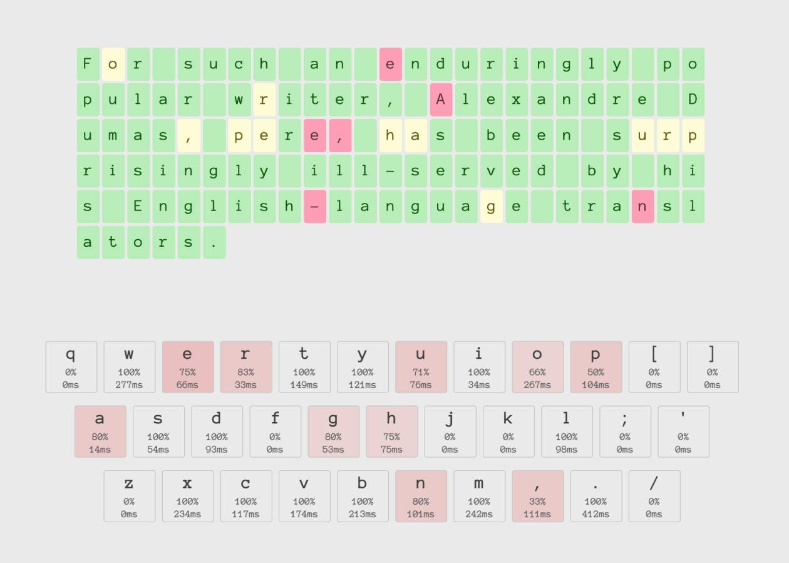

# Letter Fixer

[Letter Fixer](https://letterfixer.com) is a little tool that has you do some touch typing, then tells you which letters you should work on.

It's built with TS and SCSS from the `src` directory, which compile to the JS and CSS files found at `/`.

## To run the app

- `npm i`
- `npm run start`
- edit the TS code in `/src/script.ts`
- edits the styles in `/src/stylesheet.scss`
- ... `/index.html`

As long as the scss compiler and TSC are running, your files should be compiled to JS and CSS.
